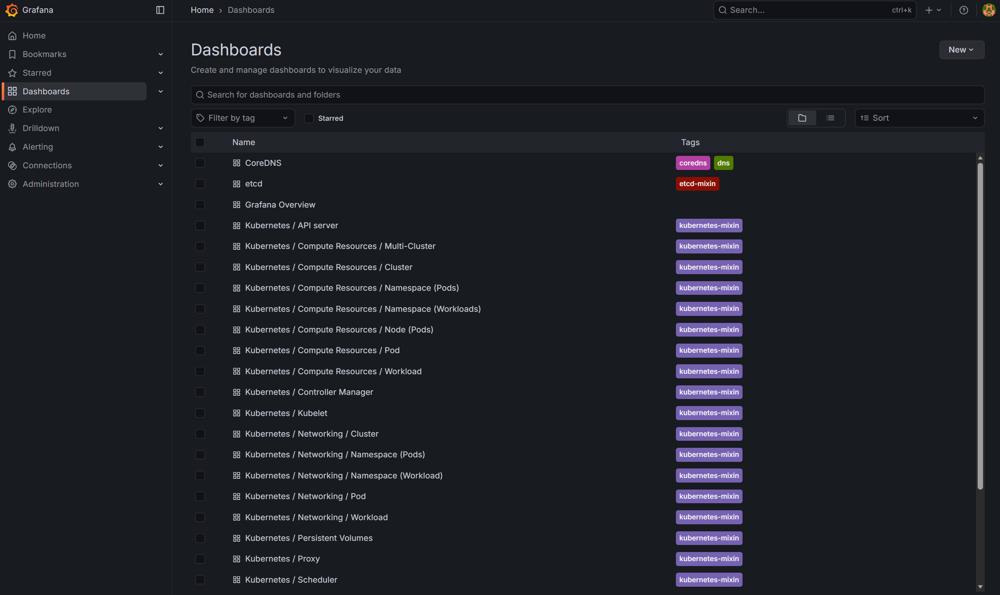
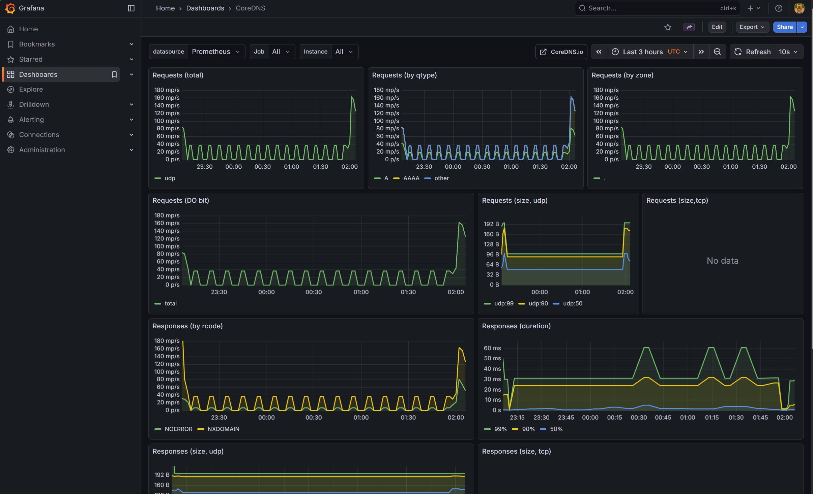
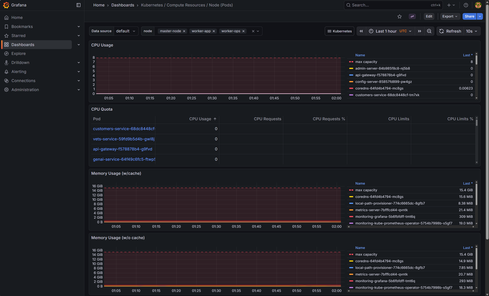
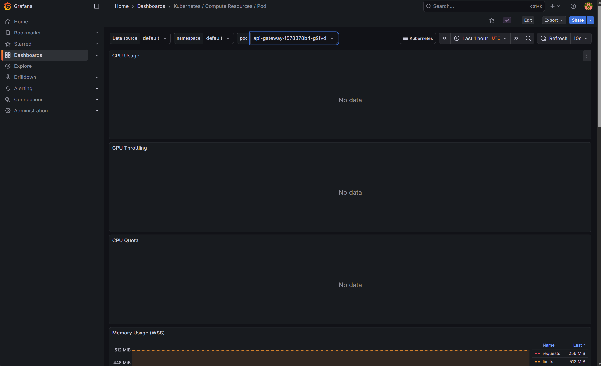
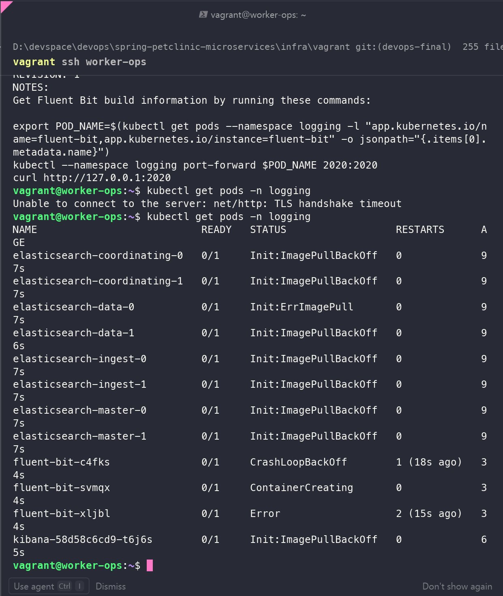

# BÁO CÁO CAPSTONE PROJECT: TRIỂN KHAI HẠ TẦNG KUBERNETES & CI/CD CHO SPRING PETCLINIC

**Người thực hiện:** dinhduc0794 

**Ngày hoàn thành:** 22/11/2025

## MỤC LỤC

- [Tổng quan Kiến trúc](#tổng-quan-kiến-trúc)
- [Giai đoạn 1: Chuẩn bị Repository & Cấu trúc dự án](#giai-đoạn-1-chuẩn-bị-repository--cấu-trúc-dự-án)
- [Giai đoạn 2: Infrastructure as Code (Vagrant)](#giai-đoạn-2-infrastructure-as-code-vagrant)
- [Giai đoạn 3: Triển khai Kubernetes Cluster (K3s)](#giai-đoạn-3-triển-khai-kubernetes-cluster-k3s)
- [Giai đoạn 4: Thiết lập CI/CD với GitHub Actions](#giai-đoạn-4-thiết-lập-cicd-với-github-actions)
- [Kết luận](#kết-luận)

## TỔNG QUAN KIẾN TRÚC

Dự án sử dụng mô hình 3-Node Cluster (Model C) để đảm bảo tính thực tế và hiệu năng, phân tách rõ ràng giữa Control Plane và Worker Node.

- **Master Node (192.168.56.10):** Chạy Control Plane (API Server, Scheduler, Controller Manager). Sử dụng 6GB RAM, 4 CPU.
- **Worker Ops (192.168.56.11):** Node dành riêng cho vận hành (Operations). Chạy GitHub Actions Runner, Prometheus, Grafana. Sử dụng 6GB RAM, 2 CPU để xử lý các tác vụ Build nặng.
- **Worker App (192.168.56.12):** Node dành cho ứng dụng (Application Workload). Chạy các Microservices của PetClinic. Sử dụng 4GB RAM, 2 CPU.

*(Hình 1: Sơ đồ kiến trúc hệ thống 3 Node)*

# PHẦN 1: TƯ DUY DEVOPS & THIẾT KẾ WORKFLOW

## 1. Triết lý Tiếp cận (DevOps Philosophy)
Dự án Spring PetClinic Microservices được xây dựng dựa trên các nguyên lý cốt lõi của DevOps hiện đại nhằm đảm bảo tốc độ phát triển nhanh nhưng vẫn giữ được sự ổn định của hệ thống:

* **Infrastructure as Code (IaC):** Toàn bộ hạ tầng (Máy ảo, Mạng, Kubernetes Cluster) được định nghĩa bằng code (`Vagrantfile`, Shell Scripts) thay vì cấu hình thủ công. Điều này đảm bảo tính nhất quán và khả năng tái tạo (Reproducibility) môi trường bất cứ lúc nào.
* **Automation First:** Loại bỏ tối đa các thao tác thủ công. Từ việc dựng máy chủ (Provisioning) đến triển khai ứng dụng (Deployment) đều được tự động hóa qua Pipeline.
* **Separation of Concerns (SoC):** Phân tách rõ ràng giữa môi trường Quản trị (Master Node), Vận hành (Ops Node), và Ứng dụng (App Node) để tối ưu hóa tài nguyên và tăng cường bảo mật.

## 2. Hệ sinh thái Công cụ (Toolchain Landscape)

Dưới đây là danh sách chi tiết các công cụ được lựa chọn và vai trò của chúng trong hệ thống:

| Lớp (Layer) | Công cụ | Vai trò & Lý do lựa chọn |
| :--- | :--- | :--- |
| **Source Control** | **GitHub** | Lưu trữ mã nguồn, quản lý phiên bản, và là trung tâm điều phối CI/CD. Sử dụng tính năng *Branch Protection Rules* để đảm bảo quy trình Review Code nghiêm ngặt trước khi merge vào nhánh chính. |
| **Virtualization** | **VirtualBox** | Hypervisor loại 2, cung cấp nền tảng ảo hóa để chạy các node Linux (Ubuntu 22.04) trên máy tính cá nhân (Windows Host). |
| **IaC / Provisioning** | **Vagrant** | Công cụ định nghĩa và quản lý vòng đời máy ảo. Giúp dựng môi trường Lab 3-node chuẩn chỉnh chỉ với một lệnh `vagrant up`, tự động hóa việc cài đặt Docker và cấu hình mạng. |
| **Config Mgmt** | **Shell Scripts** | (Thay thế cho Ansible trong phạm vi Lab này) Tự động cài đặt Docker, K3s, và các dependencies ngay khi máy ảo khởi động (Bootstrapping), đảm bảo môi trường luôn sẵn sàng. |
| **Orchestrator** | **K3s (Kubernetes)** | Phiên bản Kubernetes nhẹ (Lightweight), được CNCF chứng nhận. K3s lý tưởng cho môi trường Lab/Edge vì tốn ít RAM/CPU hơn K8s gốc (Kubeadm) nhưng vẫn cung cấp đầy đủ tính năng API chuẩn. |
| **Container Engine** | **Docker** | Môi trường thực thi (Runtime) cho việc đóng gói ứng dụng và chạy các container bên trong K3s (thông qua Containerd CRI). |
| **CI/CD** | **GitHub Actions** | Nền tảng tự động hóa quy trình Build - Test - Deploy. |
| **Runner** | **Self-hosted Runner** | Agent chạy trực tiếp trên node `worker-ops` trong mạng nội bộ. Giúp tiết kiệm chi phí Cloud và cho phép deploy trực tiếp vào Cluster K3s mà không cần mở cổng API ra Internet (Bảo mật cao). |
| **Artifact Hub** | **Docker Hub** | Kho lưu trữ Docker Image tập trung, giúp phân phối Image từ bước Build sang bước Deploy. |

## 3. Thiết kế Kiến trúc Hạ tầng (Infrastructure Design)

Hệ thống được thiết kế theo mô hình **Cluster 3-Node (Model C)** để mô phỏng môi trường Production thực tế:

### 3.1. Master Node (Control Plane)
* **IP:** `192.168.56.10`
* **Nhiệm vụ:** Chuyên trách quản lý Cluster (API Server, Scheduler, Etcd). Không chạy ứng dụng nghiệp vụ để đảm bảo độ ổn định cao nhất cho hệ thống điều khiển.

### 3.2. Worker Ops (Operations Node) - *Điểm đặc biệt*
* **IP:** `192.168.56.11`
* **Nhiệm vụ:** Đây là node "hậu cần".
    * Chạy **GitHub Actions Runner**: Thực hiện các tác vụ nặng như Build Java (Maven), Build Docker Image. Việc tách node này giúp quá trình Build không làm treo ứng dụng chính.
    * Chạy **Monitoring Stack**: Prometheus/Grafana sẽ nằm ở đây để giám sát 2 node còn lại.

### 3.3. Worker App (Workload Node)
* **IP:** `192.168.56.12`
* **Nhiệm vụ:** Môi trường thuần túy để chạy các Microservices của Spring PetClinic (Gateway, Customers, Vets...). Đảm bảo tài nguyên (RAM/CPU) được dành trọn vẹn cho ứng dụng phục vụ người dùng.

## 4. Quy trình CI/CD (Continuous Integration & Deployment)

Workflow được thiết kế tự động hóa hoàn toàn (End-to-End Pipeline):

### Giai đoạn 1: Continuous Integration (CI)
1.  **Trigger:** Developer tạo Pull Request vào nhánh `main` (hoặc push vào main).
2.  **Checkout:** GitHub Runner (trên `worker-ops`) tải mã nguồn mới nhất về.
3.  **Build & Test:**
    * Sử dụng Maven Wrapper (`./mvnw`) để biên dịch mã nguồn Java thành các file `.jar`.
    * (Optional) Chạy Unit Test để đảm bảo chất lượng code.
4.  **Dockerize & Push:**
    * Sử dụng Dockerfile tối ưu (Generic Dockerfile) để đóng gói file `.jar` vào Docker Image.
    * Image được gắn thẻ (Tag) bằng mã Commit SHA (ví dụ: `config-server:a1b2c3d`) để định danh duy nhất.
    * Đẩy (Push) Image lên Docker Hub Registry.

### Giai đoạn 2: Continuous Deployment (CD)
1.  **Update Manifest:**
    * Pipeline tự động chỉnh sửa các file Kubernetes Deployment (`.yaml`), thay thế tag `latest` bằng tag Commit SHA vừa build (sử dụng `sed`).
2.  **Apply to Cluster:**
    * Runner sử dụng `kubectl` (đã được ủy quyền config) để gửi lệnh cập nhật tới Master Node.
3.  **Rolling Update:**
    * Kubernetes thực hiện chiến lược Rolling Update: Tạo Pod mới -> Chờ Pod mới `Ready` -> Tắt Pod cũ. Đảm bảo **Zero Downtime** (Không gián đoạn dịch vụ).

## 5. Các Chiến lược Quản trị (Governance)

* **Quản lý Bí mật (Secrets Management):**
    * Không bao giờ lưu mật khẩu/token trong code (Hardcode).
    * Sử dụng **GitHub Secrets** để mã hóa `DOCKER_USERNAME`, `DOCKER_PASSWORD`, `KUBE_CONFIG`.
    * Sử dụng **Kubernetes Secrets** (nếu có) cho các cấu hình nhạy cảm trong Cluster.

* **Quản lý Phiên bản (Versioning Strategy):**
    * Sử dụng **Commit SHA** cho môi trường Dev/Staging để truy vết lỗi nhanh chóng đến từng dòng code thay đổi.
    * Sử dụng **Semantic Versioning (v1.0.0)** cho môi trường Production khi đánh Tag phát hành.

* **Khả năng Tự phục hồi (Self-healing):**
    * Sử dụng Kubernetes `Deployment` với `replicas` xác định. Nếu Pod bị crash hoặc Node bị lỗi, Kubernetes Controller Manager sẽ tự động tạo lại Pod mới để đảm bảo trạng thái mong muốn (Desired State).

---

# PHẦN 2: THỰC HÀNH TRIỂN KHAI (Hands-on Lab)

## GIAI ĐOẠN 1: CHUẨN BỊ REPOSITORY & CẤU TRÚC DỰ ÁN

### 2.1. Tái cấu trúc thư mục (Refactoring)

Để tuân thủ nguyên tắc Separation of Concerns (Tách biệt mối quan tâm), tôi đã tái cấu trúc repository gốc, tách biệt mã nguồn ứng dụng và mã nguồn hạ tầng.

Cây thư mục chuẩn:

```
.
├── .github/workflows/     # Chứa pipeline CI/CD
├── infra/
│   └── vagrant/           # Chứa mã nguồn IaC (Vagrantfile, Scripts)
├── k8s/                   # Chứa Manifest Kubernetes (Deployment, Service)
├── src/                   # Chứa toàn bộ Source Code Java & Maven Wrapper
└── report.md              # Tài liệu báo cáo
```


### 2.2. Thiết lập GitHub Repository

- **Branch Protection Rule:** Thiết lập rule cho nhánh main.
  - Yêu cầu Pull Request trước khi merge.
  - Ngăn chặn push trực tiếp (Force push disabled).
- **Mục đích:** Đảm bảo quy trình Review Code và tính ổn định của nhánh Production.


## GIAI ĐOẠN 2: INFRASTRUCTURE AS CODE (VAGRANT)

### 3.1. Viết Script Bootstrap (bootstrap.sh)

Đây là script chạy đầu tiên khi máy ảo khởi động để cài đặt môi trường cơ bản (Docker, tắt Swap...).

**File:** infra/vagrant/scripts/bootstrap.sh

```bash
#!/bin/bash
set -e  # Dừng script ngay lập tức nếu có lệnh bị lỗi

echo "--------------------------------------------------"
echo "STARTING BOOTSTRAP PROVISIONING..."
echo "--------------------------------------------------"

# 1. Cấu hình Hostname và IP Resolution
echo "[TASK 1] Setup /etc/hosts"
cat >> /etc/hosts <<EOF
192.168.56.10 master-node
192.168.56.11 worker-ops
192.168.56.12 worker-app
EOF

# 2. Tắt Swap (Bắt buộc cho Kubernetes hoạt động ổn định)
echo "[TASK 2] Disable Swap"
swapoff -a
sed -i '/swap/d' /etc/fstab

# 3. Cài đặt các gói phụ thuộc cơ bản
echo "[TASK 3] Install Basic Tools"
apt-get update -y > /dev/null
apt-get install -y apt-transport-https ca-certificates curl software-properties-common gnupg2 net-tools iputils-ping telnet git vim > /dev/null

# 4. Cài đặt Container Runtime (Docker Engine)
echo "[TASK 4] Install Docker Engine"
install -m 0755 -d /etc/apt/keyrings
curl -fsSL https://download.docker.com/linux/ubuntu/gpg | gpg --dearmor -o /etc/apt/keyrings/docker.gpg
chmod a+r /etc/apt/keyrings/docker.gpg

echo \
  "deb [arch=$(dpkg --print-architecture) signed-by=/etc/apt/keyrings/docker.gpg] https://download.docker.com/linux/ubuntu \
  $(. /etc/os-release && echo "$VERSION_CODENAME") stable" | \
  tee /etc/apt/sources.list.d/docker.list > /dev/null
apt-get update -y > /dev/null

apt-get install -y docker-ce docker-ce-cli containerd.io docker-buildx-plugin docker-compose-plugin > /dev/null

# 5. Cấu hình Docker Daemon (Cgroup Driver = Systemd)
# Đây là Best Practice cho Kubernetes để quản lý tài nguyên đồng nhất với OS
echo "[TASK 5] Configure Docker Daemon"
cat <<EOF | tee /etc/docker/daemon.json
{
  "exec-opts": ["native.cgroupdriver=systemd"],
  "log-driver": "json-file",
  "log-opts": {
    "max-size": "100m"
  },
  "storage-driver": "overlay2"
}
EOF

systemctl enable docker > /dev/null
systemctl daemon-reload
systemctl restart docker

# 6. Phân quyền cho user 'vagrant'
echo "[TASK 6] Add user to docker group"
usermod -aG docker vagrant

echo "--------------------------------------------------"
echo "BOOTSTRAP COMPLETED SUCCESSFULLY!"
echo "--------------------------------------------------"
```

### 3.2. Cấu hình Vagrantfile

File cấu hình chính để định nghĩa tài nguyên cho 3 máy ảo. Đã xử lý các vấn đề tương thích với WSL/Windows bằng cách tắt insert_key và config uart.

**File:** infra/vagrant/Vagrantfile

```ruby
# -*- mode: ruby -*-
# vi: set ft=ruby :

Vagrant.configure("2") do |config|
  # FIX LỖI PERMISSION TRÊN WINDOWS: Không đổi SSH Key tự động
  config.ssh.insert_key = false 

  # --- OS Configuration ---
  config.vm.box = "ubuntu/jammy64" # Ubuntu 22.04 LTS
  config.vm.box_check_update = false

  # --- Provider Configuration (VirtualBox) ---
  config.vm.provider "virtualbox" do |vb|
    vb.gui = true # Bật GUI để dễ debug nếu treo
    vb.cpus = 2
    vb.memory = "4096"
    vb.customize ["modifyvm", :id, "--nested-hw-virt", "on"]
    vb.customize ["modifyvm", :id, "--ioapic", "on"]
    
    # FIX LỖI WSL: Ngắt kết nối cổng Serial
    vb.customize ["modifyvm", :id, "--uart1", "0x3F8", "4"]
    vb.customize ["modifyvm", :id, "--uartmode1", "disconnected"]
  end

  # --- Provisioning Chung ---
  config.vm.provision "shell", path: "scripts/bootstrap.sh"

  # --- NODE DEFINITIONS ---

  # 1. Master Node
  config.vm.define "master" do |master|
    master.vm.hostname = "master-node"
    master.vm.network "private_network", ip: "192.168.56.10"
    # Tăng tài nguyên riêng cho Master (4 CPU, 6GB RAM)
    master.vm.provider "virtualbox" do |vb|
      vb.memory = "6144"
      vb.cpus = 4
    end
  end

  # 2. Worker Ops
  config.vm.define "worker-ops" do |ops|
    ops.vm.hostname = "worker-ops"
    ops.vm.network "private_network", ip: "192.168.56.11"
    ops.vm.provider "virtualbox" do |vb|
      vb.memory = "6144" # Cần RAM lớn để chạy CI/CD
      vb.cpus = 2
    end
  end

  # 3. Worker App
  config.vm.define "worker-app" do |app|
    app.vm.hostname = "worker-app"
    app.vm.network "private_network", ip: "192.168.56.12"
  end
end
```

### 3.3. Thực thi Triển khai (Execution)

Thực hiện các lệnh sau trên PowerShell (Administrator) để khởi tạo môi trường:

```powershell
# 1. Di chuyển vào thư mục dự án
cd D:\devspace\devops\spring-petclinic-microservices\infra\vagrant

# 2. Khởi tạo máy ảo (lần lượt để tránh quá tải)
vagrant up master
vagrant up worker-ops
vagrant up worker-app

# 3. Kiểm tra trạng thái
vagrant status
```

Kết quả: 3 máy ảo ở trạng thái running.


## GIAI ĐOẠN 3: TRIỂN KHAI KUBERNETES CLUSTER (K3S)

Sử dụng K3s để tối ưu hóa tài nguyên thay cho Kubeadm, đồng thời khắc phục các vấn đề về Cgroup Driver.

### 4.1. Script Cài đặt Master (install_k3s_master.sh)

Script này cài đặt K3s Server, cấu hình IP mạng nội bộ (enp0s8), và xuất Token để worker join.

**File:** infra/vagrant/scripts/install_k3s_master.sh

```bash
#!/bin/bash
set -e

echo "[MASTER] STARTING K3S INSTALLATION..."

# 1. Dọn dẹp môi trường cũ
echo "Cleaning up Docker/Kubeadm..."
sudo systemctl stop docker
sudo systemctl disable docker
sudo kubeadm reset -f || true
sudo rm -rf /etc/cni/net.d

# 2. Cài đặt K3s Server
# --node-ip: IP tĩnh của Master
# --flannel-iface: Interface mạng nội bộ (enp0s8)
# --disable=traefik: Tắt Ingress mặc định
echo "Installing K3s Server..."
curl -sfL https://get.k3s.io | INSTALL_K3S_EXEC="server --node-ip=192.168.56.10 --flannel-iface=enp0s8 --write-kubeconfig-mode 644 --disable=traefik" sh -

# 3. Lưu Token ra thư mục chia sẻ
echo "Saving Node Token to shared folder..."
while [ ! -f /var/lib/rancher/k3s/server/node-token ]; do
  sleep 2
done
cp /var/lib/rancher/k3s/server/node-token /vagrant/node-token

# 4. Cấu hình kubectl
echo "Configuring kubectl..."
mkdir -p /home/vagrant/.kube
cp /etc/rancher/k3s/k3s.yaml /home/vagrant/.kube/config
chown -R vagrant:vagrant /home/vagrant/.kube
echo "alias k=kubectl" >> /home/vagrant/.bashrc
echo "alias kubectl='sudo k3s kubectl'" >> /home/vagrant/.bashrc

echo "[MASTER] SETUP COMPLETED! Token saved to /vagrant/node-token"
```

### 4.2. Script Cài đặt Worker (install_k3s_worker.sh)

Script này tự động đọc IP của máy hiện tại và Token từ thư mục chia sẻ để join vào cluster.

**File:** infra/vagrant/scripts/install_k3s_worker.sh

```bash
#!/bin/bash
set -e

# Tự động lấy IP của interface enp0s8
CURRENT_IP=$(ip -4 addr show enp0s8 | grep -oP '(?<=inet\s)\d+(\.\d+){3}')
MASTER_IP="192.168.56.10"

echo "[WORKER] STARTING K3S AGENT INSTALLATION on $CURRENT_IP..."

# 1. Dọn dẹp môi trường cũ
echo "Cleaning up Docker/Kubeadm..."
sudo systemctl stop docker
sudo systemctl disable docker
sudo kubeadm reset -f || true
sudo rm -rf /etc/cni/net.d

# 2. Đọc Token từ file chia sẻ
TOKEN_FILE="/vagrant/node-token"
if [ ! -f "$TOKEN_FILE" ]; then
  echo "ERROR: Token file not found at $TOKEN_FILE"
  exit 1
fi
K3S_TOKEN=$(cat $TOKEN_FILE)

# 3. Cài đặt K3s Agent (Worker)
echo "Joining Cluster at $MASTER_IP..."
curl -sfL https://get.k3s.io | K3S_URL=https://$MASTER_IP:6443 K3S_TOKEN="$K3S_TOKEN" INSTALL_K3S_EXEC="agent --node-ip=$CURRENT_IP --flannel-iface=enp0s8" sh -

echo "[WORKER] JOINED CLUSTER SUCCESSFULLY!"
```

### 4.3. Thực thi Cài đặt (Execution)

**Bước 1: Cài đặt Master**

```powershell
# Trên PowerShell
vagrant ssh master
```

```bash
# Trong máy ảo Master
sudo bash /vagrant/scripts/install_k3s_master.sh
```

Kết quả: Master cài xong, token được tạo ra tại /vagrant/node-token.


**Bước 2: Cài đặt Worker**

```powershell
# Trên PowerShell (Mở tab mới)
vagrant ssh worker-ops
```

```bash
sudo bash /vagrant/scripts/install_k3s_worker.sh
```

Kết quả: Worker Ops cài xong.


```powershell
# Trên PowerShell (Tab khác)
vagrant ssh worker-app
```

```bash
sudo bash /vagrant/scripts/install_k3s_worker.sh
```
Kết quả: Worker App cài xong.


**Bước 3: Kiểm tra Cluster**

Quay lại Master Node và kiểm tra:

```bash
kubectl get nodes
```

Kết quả:

```
NAME          STATUS   ROLES                  AGE   VERSION
master-node   Ready    control-plane,master   10m   v1.33.5+k3s1
worker-ops    Ready    <none>                 2m    v1.33.5+k3s1
worker-app    Ready    <none>                 56s   v1.33.5+k3s1
```


## GIAI ĐOẠN 4: THIẾT LẬP CI/CD VỚI GITHUB ACTIONS

Hệ thống CI/CD được thiết kế để tự động hóa hoàn toàn quy trình từ khi Developer đẩy mã nguồn lên GitHub cho đến khi ứng dụng chạy thực tế trên Kubernetes Cluster.

### 4.1. Thiết lập Self-hosted Runner

Thay vì sử dụng Cloud Runner mặc định của GitHub, tôi thiết lập **Self-hosted Runner** chạy trực tiếp trên node `worker-ops`.

**Lý do lựa chọn:**
1.  **Bảo mật & Kết nối:** Runner nằm trong mạng nội bộ (Private Network), có thể kết nối trực tiếp tới Master Node thông qua `kubectl` mà không cần mở cổng API Server ra Internet công cộng.
2.  **Hiệu năng:** Tận dụng tài nguyên phần cứng (6GB RAM) của máy ảo `worker-ops` để tăng tốc độ build Java (Maven) và Docker, tránh hiện tượng nghẽn cổ chai trên Cloud Runner miễn phí.
3.  **Chi phí:** Tiết kiệm chi phí minutes của GitHub Actions.

**Quy trình cài đặt (Thực hiện trên `worker-ops`):**

1.  **Đăng ký Runner:**
    * Tại GitHub Repo: **Settings > Actions > Runners > New self-hosted runner**.
    * Chọn OS: **Linux**, Architecture: **x64**.

2.  **Cài đặt Agent:**
    ```bash
    # Tạo thư mục và tải runner
    mkdir actions-runner && cd actions-runner
    curl -o actions-runner-linux-x64.tar.gz -L [https://github.com/actions/runner/releases/download/v2.320.0/actions-runner-linux-x64-2.320.0.tar.gz](https://github.com/actions/runner/releases/download/v2.320.0/actions-runner-linux-x64-2.320.0.tar.gz)
    tar xzf ./actions-runner-linux-x64.tar.gz

    # Cấu hình kết nối (Sử dụng Token từ GitHub)
    ./config.sh --url [https://github.com/dinhduc0794/spring-petclinic-microservices](https://github.com/dinhduc0794/spring-petclinic-microservices) --token <YOUR_GITHUB_TOKEN>
    # Name: worker-ops-runner
    ```

3.  **Cấu hình chạy ngầm (Service):**
    Để đảm bảo Runner luôn hoạt động (ngay cả khi reboot), tôi cài đặt nó dưới dạng Systemd Service:
    ```bash
    sudo ./svc.sh install
    sudo ./svc.sh start
    ```

4.  **Chuẩn bị môi trường Build:**
    Cài đặt các công cụ cần thiết cho quy trình build trên máy `worker-ops`:
    ```bash
    sudo apt-get update
    sudo apt-get install -y openjdk-17-jdk maven docker.io
    ```

5.  **Ủy quyền Kubernetes:**
    
    Xuất key từ máy Master
    ```bash
    # Copy file config ra thư mục chia sẻ
    sudo cp /etc/rancher/k3s/k3s.yaml /vagrant/kubeconfig_admin
    sudo chmod 644 /vagrant/kubeconfig_admin
    ```

    Copy file cấu hình `kubeconfig` từ Master sang Worker Ops để Runner có quyền thực thi lệnh `kubectl`.
    ```bash
    # 1. Tạo thư mục config
    mkdir -p ~/.kube

    # 2. Copy file từ thư mục chia sẻ vào
    cp /vagrant/kubeconfig_admin ~/.kube/config

    # 3. Sửa IP (Vì file gốc trỏ về 127.0.0.1 của Master, sửa thành IP Master 192.168.56.10)
    sed -i 's/127.0.0.1/192.168.56.10/g' ~/.kube/config

    # 4. Phân quyền cho user hiện tại (vagrant)
    chmod 600 ~/.kube/config

    # 5. Test thử
    kubectl get nodes
    ```

**Kết quả:** Runner hiển thị trạng thái **Idle (Xanh)** trên GitHub Settings.

### 4.2. Quy trình Thao tác Git & Kích hoạt Pipeline

Để đảm bảo tính ổn định cho nhánh `main` (Production), quy trình phát triển tuân thủ nghiêm ngặt các bước:

1.  **Phát triển:** Developer tạo nhánh mới (ví dụ `devops-final`) để thực hiện thay đổi code.
2.  **Commit & Push:** Đẩy code lên nhánh phụ.
3.  **Pull Request (PR):** Tạo PR yêu cầu hợp nhất vào `main`.
4.  **Merge:** Sau khi review, thực hiện Merge PR. Sự kiện `push to main` này sẽ kích hoạt Pipeline.

### 4.3. Chi tiết Pipeline (`deploy.yml`)

File cấu hình `.github/workflows/deploy.yml` định nghĩa quy trình tự động hóa gồm các bước:

1.  **Checkout Code:** Lấy mã nguồn mới nhất.
2.  **Build Maven:** Biên dịch mã nguồn Java thành file `.jar` (Sử dụng Maven Wrapper để đảm bảo tính tương thích).
3.  **Docker Build & Push:**
    * Đăng nhập Docker Hub (Sử dụng Token bảo mật qua GitHub Secrets).
    * Đóng gói file `.jar` vào Docker Image (Sử dụng Generic Dockerfile).
    * Gán thẻ (Tag) bằng **Commit SHA** (`${{ github.sha }}`) để định danh phiên bản duy nhất.
    * Đẩy (Push) lên Docker Hub.
4.  **Deploy to K3s:**
    * Tự động cập nhật file manifest Kubernetes: Thay thế tag `:latest` bằng tag Commit SHA vừa build.
    * Áp dụng cấu hình mới vào Cluster (`kubectl apply`).
    * Chờ đợi (`rollout status`) để đảm bảo ứng dụng khởi động thành công trước khi báo cáo kết quả.

---

## GIAI ĐOẠN 5: GIÁM SÁT HỆ THỐNG (OBSERVABILITY)

Hệ thống giám sát được triển khai trên node `worker-ops` sử dụng bộ công cụ tiêu chuẩn công nghiệp: **Prometheus** (thu thập metrics) và **Grafana** (hiển thị dashboard).

### 5.1. Triển khai bằng Helm Chart

Sử dụng **Helm** (Kubernetes Package Manager) để cài đặt gói `kube-prometheus-stack`. Đây là giải pháp "All-in-one" giúp cài đặt và cấu hình tự động Prometheus, Grafana, Node Exporter.

**Các bước thực hiện trên `worker-ops`:**

1.  **Cài đặt Helm:**
    ```bash
    curl [https://raw.githubusercontent.com/helm/helm/main/scripts/get-helm-3](https://raw.githubusercontent.com/helm/helm/main/scripts/get-helm-3) | bash
    ```

2.  **Thêm Repo & Cài đặt Stack:**
    ```bash
    helm repo add prometheus-community [https://prometheus-community.github.io/helm-charts](https://prometheus-community.github.io/helm-charts)
    helm repo update
    
    # Tạo namespace riêng biệt
    kubectl create namespace observability

    # Cài đặt Stack và mở cổng NodePort 30300 cho Grafana
    helm install monitoring prometheus-community/kube-prometheus-stack \
      --namespace observability \
      --set grafana.service.type=NodePort \
      --set grafana.service.nodePort=30300 \
      --set alertmanager.enabled=false
    ```

### 5.2. Truy cập Dashboard Giám sát

Sau khi triển khai, Grafana có thể truy cập trực tiếp từ trình duyệt máy chủ (Windows) thông qua mạng nội bộ Vagrant.

* **URL:** `http://192.168.56.11:30300`
* **Lý giải kỹ thuật:** Máy tính Windows có thể truy cập trực tiếp IP `192.168.56.11` nhờ card mạng ảo Host-only Adapter. Traffic đi đến cổng `30300` sẽ được `kube-proxy` trên node điều hướng đến Pod Grafana đang chạy trong Cluster.

**Thông tin đăng nhập:**
Mật khẩu Admin được lấy từ Kubernetes Secret (Do Helm tạo ngẫu nhiên để bảo mật):
```bash
kubectl get secret --namespace observability monitoring-grafana -o jsonpath="{.data.admin-password}" | base64 --decode ; echo
```
Kết quả:










## 5.3. Quản lý Log Tập trung (Logging - EFK Stack)

Để giải quyết vấn đề log bị phân tán trên nhiều Pods và mất đi khi Pod restart, tôi triển khai giải pháp **EFK Stack** (Elasticsearch, Fluent Bit, Kibana) để thu thập và phân tích log tập trung.

**Kiến trúc Logging:**
1.  **Fluent Bit (Collector):** Chạy dưới dạng `DaemonSet` trên từng Node. Nó đọc log từ thư mục `/var/log/containers/*.log`, gán thêm metadata (Tên Pod, Namespace) và đẩy về Elasticsearch.
2.  **Elasticsearch (Storage):** Cơ sở dữ liệu NoSQL lưu trữ và đánh chỉ mục (index) toàn bộ log.
3.  **Kibana (Visualization):** Giao diện web giúp truy vấn, tìm kiếm và hiển thị log trực quan.

### a. Triển khai Hạ tầng Logging

Do hạn chế về tài nguyên (RAM), tôi sử dụng **Fluent Bit** thay vì Fluentd (vì Fluent Bit viết bằng C, nhẹ hơn rất nhiều) và tối ưu hóa cấu hình Elasticsearch chạy ở chế độ Single-Node.

**Các lệnh cài đặt (Helm Chart):**

BƯỚC 1: Cài đặt Elasticsearch (Kho chứa Log)
```bash
# 1. Thêm Repo Bitnami
helm repo add bitnami https://charts.bitnami.com/bitnami
helm repo update

# 2. Tạo namespace logging
kubectl create namespace logging

# 3. Cài đặt Elasticsearch (Chế độ tiết kiệm: 1 Node, RAM thấp)
helm install elasticsearch bitnami/elasticsearch \
  --namespace logging \
  --set global.kibanaEnabled=false \
  --set master.replicas=1 \
  --set data.replicas=0 \
  --set coordinating.replicas=0 \
  --set ingest.replicas=0 \
  --set master.resources.requests.memory=512Mi \
  --set master.resources.limits.memory=1Gi
```
BƯỚC 2: Cài đặt Kibana (Giao diện xem Log)
```bash
# Cài đặt Kibana kết nối tới Elasticsearch vừa tạo
# Expose qua NodePort 30601 để truy cập từ Windows
helm install kibana bitnami/kibana \
  --namespace logging \
  --set elasticsearch.hosts[0]=elasticsearch \
  --set elasticsearch.port=9200 \
  --set service.type=NodePort \
  --set service.nodePort=30601
```

BƯỚC 3: Cài đặt Fluent Bit (Log Forwarder)
```bash
# 1. Thêm repo Fluent
helm repo add fluent https://fluent.github.io/helm-charts
helm repo update

# 2. Cài đặt Fluent Bit
helm install fluent-bit fluent/fluent-bit \
  --namespace logging \
  --set config.outputs="[OUTPUT]\n    Name es\n    Match *\n    Host elasticsearch.logging.svc.cluster.local\n    Port 9200\n    Index kubernetes_cluster\n    Replace_Dots On"
```

Kết quả:
```bash
kubectl get pods -n logging
```


Truy cập: http://192.168.56.11:30601 để xem log trên giao diện Kibana