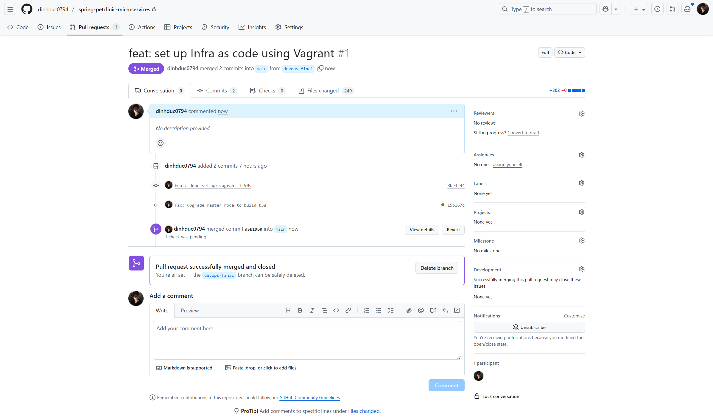
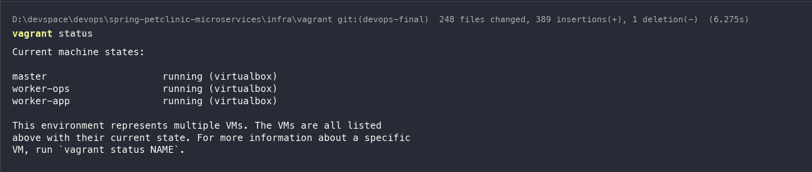
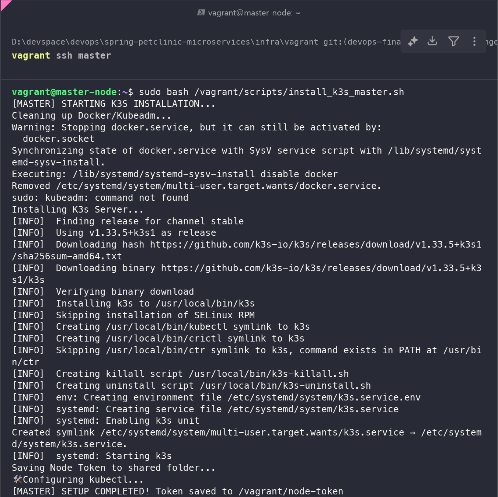
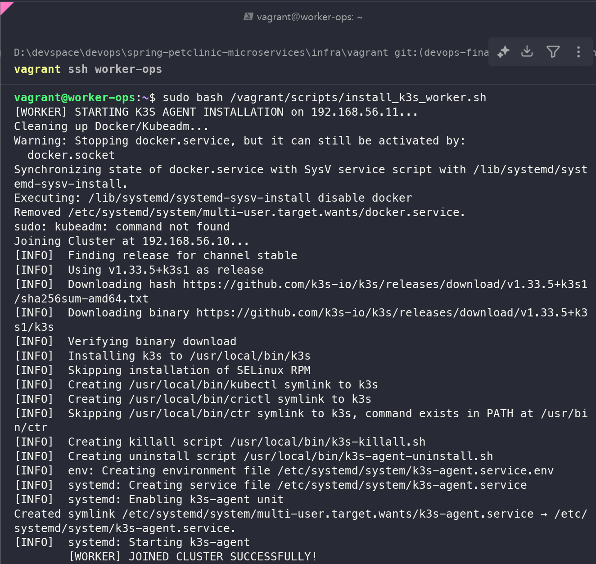
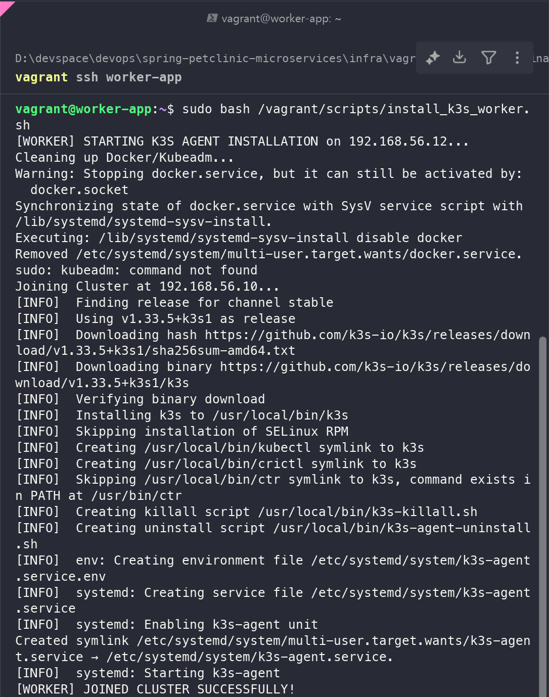
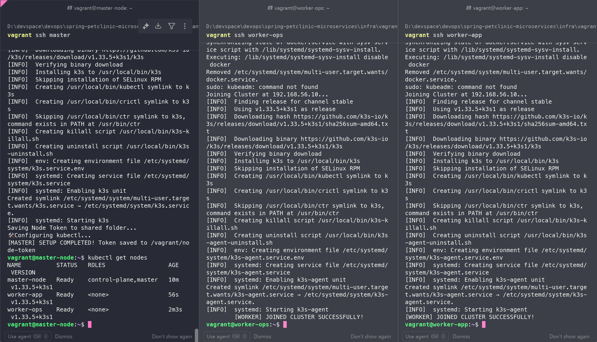

# BÁO CÁO CAPSTONE PROJECT: TRIỂN KHAI HẠ TẦNG KUBERNETES & CI/CD CHO SPRING PETCLINIC

**Người thực hiện:** dinhduc0794 

**Ngày hoàn thành:** 22/11/2025

## MỤC LỤC

- [Tổng quan Kiến trúc](#tổng-quan-kiến-trúc)
- [Giai đoạn 1: Chuẩn bị Repository & Cấu trúc dự án](#giai-đoạn-1-chuẩn-bị-repository--cấu-trúc-dự-án)
- [Giai đoạn 2: Infrastructure as Code (Vagrant)](#giai-đoạn-2-infrastructure-as-code-vagrant)
- [Giai đoạn 3: Triển khai Kubernetes Cluster (K3s)](#giai-đoạn-3-triển-khai-kubernetes-cluster-k3s)
- [Giai đoạn 4: Thiết lập CI/CD với GitHub Actions](#giai-đoạn-4-thiết-lập-cicd-với-github-actions)
- [Kết luận](#kết-luận)

## TỔNG QUAN KIẾN TRÚC

Dự án sử dụng mô hình 3-Node Cluster (Model C) để đảm bảo tính thực tế và hiệu năng, phân tách rõ ràng giữa Control Plane và Worker Node.

- **Master Node (192.168.56.10):** Chạy Control Plane (API Server, Scheduler, Controller Manager). Sử dụng 6GB RAM, 4 CPU.
- **Worker Ops (192.168.56.11):** Node dành riêng cho vận hành (Operations). Chạy GitHub Actions Runner, Prometheus, Grafana. Sử dụng 6GB RAM, 2 CPU để xử lý các tác vụ Build nặng.
- **Worker App (192.168.56.12):** Node dành cho ứng dụng (Application Workload). Chạy các Microservices của PetClinic. Sử dụng 4GB RAM, 2 CPU.

*(Hình 1: Sơ đồ kiến trúc hệ thống 3 Node)*

## GIAI ĐOẠN 1: CHUẨN BỊ REPOSITORY & CẤU TRÚC DỰ ÁN

### 2.1. Tái cấu trúc thư mục (Refactoring)

Để tuân thủ nguyên tắc Separation of Concerns (Tách biệt mối quan tâm), tôi đã tái cấu trúc repository gốc, tách biệt mã nguồn ứng dụng và mã nguồn hạ tầng.

Cây thư mục chuẩn:

```
.
├── .github/workflows/     # Chứa pipeline CI/CD
├── infra/
│   └── vagrant/           # Chứa mã nguồn IaC (Vagrantfile, Scripts)
├── k8s/                   # Chứa Manifest Kubernetes (Deployment, Service)
├── src/                   # Chứa toàn bộ Source Code Java & Maven Wrapper
└── report.md              # Tài liệu báo cáo
```


### 2.2. Thiết lập GitHub Repository

- **Branch Protection Rule:** Thiết lập rule cho nhánh main.
  - Yêu cầu Pull Request trước khi merge.
  - Ngăn chặn push trực tiếp (Force push disabled).
- **Mục đích:** Đảm bảo quy trình Review Code và tính ổn định của nhánh Production.



## GIAI ĐOẠN 2: INFRASTRUCTURE AS CODE (VAGRANT)

### 3.1. Viết Script Bootstrap (bootstrap.sh)

Đây là script chạy đầu tiên khi máy ảo khởi động để cài đặt môi trường cơ bản (Docker, tắt Swap...).

**File:** infra/vagrant/scripts/bootstrap.sh

```bash
#!/bin/bash
set -e  # Dừng script ngay lập tức nếu có lệnh bị lỗi

echo "--------------------------------------------------"
echo "STARTING BOOTSTRAP PROVISIONING..."
echo "--------------------------------------------------"

# 1. Cấu hình Hostname và IP Resolution
echo "[TASK 1] Setup /etc/hosts"
cat >> /etc/hosts <<EOF
192.168.56.10 master-node
192.168.56.11 worker-ops
192.168.56.12 worker-app
EOF

# 2. Tắt Swap (Bắt buộc cho Kubernetes hoạt động ổn định)
echo "[TASK 2] Disable Swap"
swapoff -a
sed -i '/swap/d' /etc/fstab

# 3. Cài đặt các gói phụ thuộc cơ bản
echo "[TASK 3] Install Basic Tools"
apt-get update -y > /dev/null
apt-get install -y apt-transport-https ca-certificates curl software-properties-common gnupg2 net-tools iputils-ping telnet git vim > /dev/null

# 4. Cài đặt Container Runtime (Docker Engine)
echo "[TASK 4] Install Docker Engine"
install -m 0755 -d /etc/apt/keyrings
curl -fsSL https://download.docker.com/linux/ubuntu/gpg | gpg --dearmor -o /etc/apt/keyrings/docker.gpg
chmod a+r /etc/apt/keyrings/docker.gpg

echo \
  "deb [arch=$(dpkg --print-architecture) signed-by=/etc/apt/keyrings/docker.gpg] https://download.docker.com/linux/ubuntu \
  $(. /etc/os-release && echo "$VERSION_CODENAME") stable" | \
  tee /etc/apt/sources.list.d/docker.list > /dev/null
apt-get update -y > /dev/null

apt-get install -y docker-ce docker-ce-cli containerd.io docker-buildx-plugin docker-compose-plugin > /dev/null

# 5. Cấu hình Docker Daemon (Cgroup Driver = Systemd)
# Đây là Best Practice cho Kubernetes để quản lý tài nguyên đồng nhất với OS
echo "[TASK 5] Configure Docker Daemon"
cat <<EOF | tee /etc/docker/daemon.json
{
  "exec-opts": ["native.cgroupdriver=systemd"],
  "log-driver": "json-file",
  "log-opts": {
    "max-size": "100m"
  },
  "storage-driver": "overlay2"
}
EOF

systemctl enable docker > /dev/null
systemctl daemon-reload
systemctl restart docker

# 6. Phân quyền cho user 'vagrant'
echo "[TASK 6] Add user to docker group"
usermod -aG docker vagrant

echo "--------------------------------------------------"
echo "BOOTSTRAP COMPLETED SUCCESSFULLY!"
echo "--------------------------------------------------"
```

### 3.2. Cấu hình Vagrantfile

File cấu hình chính để định nghĩa tài nguyên cho 3 máy ảo. Đã xử lý các vấn đề tương thích với WSL/Windows bằng cách tắt insert_key và config uart.

**File:** infra/vagrant/Vagrantfile

```ruby
# -*- mode: ruby -*-
# vi: set ft=ruby :

Vagrant.configure("2") do |config|
  # FIX LỖI PERMISSION TRÊN WINDOWS: Không đổi SSH Key tự động
  config.ssh.insert_key = false 

  # --- OS Configuration ---
  config.vm.box = "ubuntu/jammy64" # Ubuntu 22.04 LTS
  config.vm.box_check_update = false

  # --- Provider Configuration (VirtualBox) ---
  config.vm.provider "virtualbox" do |vb|
    vb.gui = true # Bật GUI để dễ debug nếu treo
    vb.cpus = 2
    vb.memory = "4096"
    vb.customize ["modifyvm", :id, "--nested-hw-virt", "on"]
    vb.customize ["modifyvm", :id, "--ioapic", "on"]
    
    # FIX LỖI WSL: Ngắt kết nối cổng Serial
    vb.customize ["modifyvm", :id, "--uart1", "0x3F8", "4"]
    vb.customize ["modifyvm", :id, "--uartmode1", "disconnected"]
  end

  # --- Provisioning Chung ---
  config.vm.provision "shell", path: "scripts/bootstrap.sh"

  # --- NODE DEFINITIONS ---

  # 1. Master Node
  config.vm.define "master" do |master|
    master.vm.hostname = "master-node"
    master.vm.network "private_network", ip: "192.168.56.10"
    # Tăng tài nguyên riêng cho Master (4 CPU, 6GB RAM)
    master.vm.provider "virtualbox" do |vb|
      vb.memory = "6144"
      vb.cpus = 4
    end
  end

  # 2. Worker Ops
  config.vm.define "worker-ops" do |ops|
    ops.vm.hostname = "worker-ops"
    ops.vm.network "private_network", ip: "192.168.56.11"
    ops.vm.provider "virtualbox" do |vb|
      vb.memory = "6144" # Cần RAM lớn để chạy CI/CD
      vb.cpus = 2
    end
  end

  # 3. Worker App
  config.vm.define "worker-app" do |app|
    app.vm.hostname = "worker-app"
    app.vm.network "private_network", ip: "192.168.56.12"
  end
end
```

### 3.3. Thực thi Triển khai (Execution)

Thực hiện các lệnh sau trên PowerShell (Administrator) để khởi tạo môi trường:

```powershell
# 1. Di chuyển vào thư mục dự án
cd D:\devspace\devops\spring-petclinic-microservices\infra\vagrant

# 2. Khởi tạo máy ảo (lần lượt để tránh quá tải)
vagrant up master
vagrant up worker-ops
vagrant up worker-app

# 3. Kiểm tra trạng thái
vagrant status
```

Kết quả: 3 máy ảo ở trạng thái running.



## GIAI ĐOẠN 3: TRIỂN KHAI KUBERNETES CLUSTER (K3S)

Sử dụng K3s để tối ưu hóa tài nguyên thay cho Kubeadm, đồng thời khắc phục các vấn đề về Cgroup Driver.

### 4.1. Script Cài đặt Master (install_k3s_master.sh)

Script này cài đặt K3s Server, cấu hình IP mạng nội bộ (enp0s8), và xuất Token để worker join.

**File:** infra/vagrant/scripts/install_k3s_master.sh

```bash
#!/bin/bash
set -e

echo "[MASTER] STARTING K3S INSTALLATION..."

# 1. Dọn dẹp môi trường cũ
echo "Cleaning up Docker/Kubeadm..."
sudo systemctl stop docker
sudo systemctl disable docker
sudo kubeadm reset -f || true
sudo rm -rf /etc/cni/net.d

# 2. Cài đặt K3s Server
# --node-ip: IP tĩnh của Master
# --flannel-iface: Interface mạng nội bộ (enp0s8)
# --disable=traefik: Tắt Ingress mặc định
echo "Installing K3s Server..."
curl -sfL https://get.k3s.io | INSTALL_K3S_EXEC="server --node-ip=192.168.56.10 --flannel-iface=enp0s8 --write-kubeconfig-mode 644 --disable=traefik" sh -

# 3. Lưu Token ra thư mục chia sẻ
echo "Saving Node Token to shared folder..."
while [ ! -f /var/lib/rancher/k3s/server/node-token ]; do
  sleep 2
done
cp /var/lib/rancher/k3s/server/node-token /vagrant/node-token

# 4. Cấu hình kubectl
echo "Configuring kubectl..."
mkdir -p /home/vagrant/.kube
cp /etc/rancher/k3s/k3s.yaml /home/vagrant/.kube/config
chown -R vagrant:vagrant /home/vagrant/.kube
echo "alias k=kubectl" >> /home/vagrant/.bashrc
echo "alias kubectl='sudo k3s kubectl'" >> /home/vagrant/.bashrc

echo "[MASTER] SETUP COMPLETED! Token saved to /vagrant/node-token"
```

### 4.2. Script Cài đặt Worker (install_k3s_worker.sh)

Script này tự động đọc IP của máy hiện tại và Token từ thư mục chia sẻ để join vào cluster.

**File:** infra/vagrant/scripts/install_k3s_worker.sh

```bash
#!/bin/bash
set -e

# Tự động lấy IP của interface enp0s8
CURRENT_IP=$(ip -4 addr show enp0s8 | grep -oP '(?<=inet\s)\d+(\.\d+){3}')
MASTER_IP="192.168.56.10"

echo "[WORKER] STARTING K3S AGENT INSTALLATION on $CURRENT_IP..."

# 1. Dọn dẹp môi trường cũ
echo "Cleaning up Docker/Kubeadm..."
sudo systemctl stop docker
sudo systemctl disable docker
sudo kubeadm reset -f || true
sudo rm -rf /etc/cni/net.d

# 2. Đọc Token từ file chia sẻ
TOKEN_FILE="/vagrant/node-token"
if [ ! -f "$TOKEN_FILE" ]; then
  echo "ERROR: Token file not found at $TOKEN_FILE"
  exit 1
fi
K3S_TOKEN=$(cat $TOKEN_FILE)

# 3. Cài đặt K3s Agent (Worker)
echo "Joining Cluster at $MASTER_IP..."
curl -sfL https://get.k3s.io | K3S_URL=https://$MASTER_IP:6443 K3S_TOKEN="$K3S_TOKEN" INSTALL_K3S_EXEC="agent --node-ip=$CURRENT_IP --flannel-iface=enp0s8" sh -

echo "[WORKER] JOINED CLUSTER SUCCESSFULLY!"
```

### 4.3. Thực thi Cài đặt (Execution)

**Bước 1: Cài đặt Master**

```powershell
# Trên PowerShell
vagrant ssh master
```

```bash
# Trong máy ảo Master
sudo bash /vagrant/scripts/install_k3s_master.sh
```

Kết quả: Master cài xong, token được tạo ra tại /vagrant/node-token.




**Bước 2: Cài đặt Worker**

```powershell
# Trên PowerShell (Mở tab mới)
vagrant ssh worker-ops
```

```bash
sudo bash /vagrant/scripts/install_k3s_worker.sh
```

Kết quả: Worker Ops cài xong.



```powershell
# Trên PowerShell (Tab khác)
vagrant ssh worker-app
```

```bash
sudo bash /vagrant/scripts/install_k3s_worker.sh
```
Kết quả: Worker App cài xong.



**Bước 3: Kiểm tra Cluster**

Quay lại Master Node và kiểm tra:

```bash
kubectl get nodes
```

Kết quả:

```
NAME          STATUS   ROLES                  AGE   VERSION
master-node   Ready    control-plane,master   10m   v1.33.5+k3s1
worker-ops    Ready    <none>                 2m    v1.33.5+k3s1
worker-app    Ready    <none>                 56s   v1.33.5+k3s1
```



## GIAI ĐOẠN 4: THIẾT LẬP CI/CD VỚI GITHUB ACTIONS

### 5.1. Setup Self-hosted Runner

Để tiết kiệm chi phí Cloud và tận dụng tài nguyên local, tôi cài đặt Runner trên node worker-ops.

**Thao tác:**

- Vào GitHub Repo -> Settings -> Actions -> Runners -> New self-hosted runner.
- SSH vào worker-ops: `vagrant ssh worker-ops`.
- Chạy các lệnh cài đặt Runner (Download, Config, Install Service).

Cài đặt thêm Java JDK và Maven để Runner có thể build code:

```bash
sudo apt-get update
sudo apt-get install -y openjdk-17-jdk maven
```

Kết quả: Runner hiển thị trạng thái Idle (Xanh) trên GitHub.

*(Hình 4: GitHub Runner trạng thái Active)*

### 5.2. Pipeline Workflow

(Phần này sẽ được trình bày chi tiết trong file YAML ở giai đoạn tiếp theo...)

## KẾT LUẬN

Đã hoàn thành việc xây dựng nền móng hạ tầng vững chắc với:

- **Automation:** Sử dụng Script và Vagrant để dựng môi trường tự động, có thể tái tạo (reproducible).
- **Optimization:** Tinh chỉnh tài nguyên (CPU/RAM) và Networking (Static IP, Private Network) để phù hợp với môi trường Lab hạn chế.
- **Ready for Deployment:** Cluster K3s đã sẵn sàng, Runner đã kết nối, chỉ chờ Code được đẩy lên là Pipeline sẽ chạy.